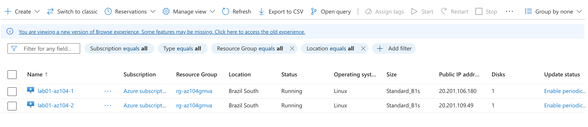
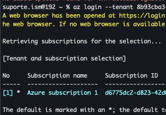

# Desafio: Gerenciando Máquinas Virtuais no Azure

Este desafio faz parte da formação **AZ-104: Azure Administrator Associate** na plataforma DIO. O objetivo é praticar a criação, gerenciamento e operação de máquinas virtuais no Azure, utilizando tanto o **Portal Azure** quanto a **Azure CLI**.

---

## Objetivo

Criar e gerenciar máquinas virtuais Linux no Azure, explorando operações essenciais como:

- Implantação de VMs
- Início e parada da VM
- Acesso remoto via SSH
- Gerenciamento de disco (desanexar)
- Verificação de status e conectividade

---

## Etapas Realizadas

### 1. Implantação de Máquinas Virtuais (Portal)

- Criadas duas VMs com imagem **Ubuntu**
- Tamanho: `Standard_B1s`
- Local: `Brazil South`
- Grupo de recursos: `rg-az104gmva`

📸 **Visualização no portal:**

!

---

### 2. Desanexando Disco da Máquina

- Simulação de manutenção via **Portal Azure**
- Desanexado manualmente o disco de dados
- Reflete uma tarefa típica de suporte ou ajuste de armazenamento

---

### 3. Gerenciamento com Azure CLI

Comandos executados via terminal para controle direto das VMs.

```bash
# Login no Azure
az login



# (Opcional) Definir assinatura
az account set --subscription "Nome da assinatura"

# Listar todas as VMs com status
az vm list -d -o table

# Parar uma VM
az vm stop \
  --name lab01-az104-1 \
  --resource-group rg-az104gmva

# Iniciar uma VM
az vm start \
  --name lab01-az104-1 \
  --resource-group rg-az104gmva

# Reiniciar uma VM
az vm restart \
  --name lab01-az104-2 \
  --resource-group rg-az104gmva

# Obter status detalhado da VM
az vm get-instance-view \
  --name lab01-az104-1 \
  --resource-group rg-az104gmva \
  --output table

# Abrir porta (ex: SSH)
az vm open-port \
  --name lab01-az104-1 \
  --resource-group rg-az104gmva \
  --port 22

# Desanexar disco de dados (exemplo)
az vm disk detach \
  --name datadisk01 \
  --vm-name lab01-az104-1 \
  --resource-group rg-az104gmva
