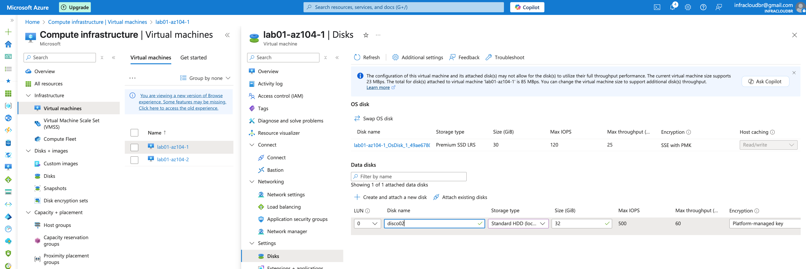
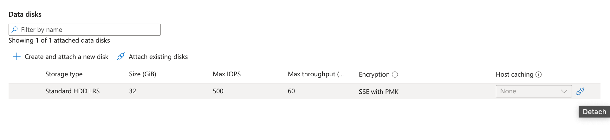
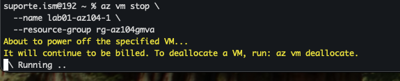
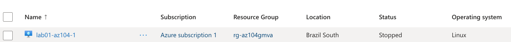
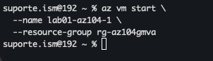
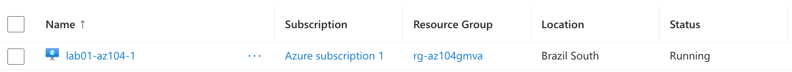
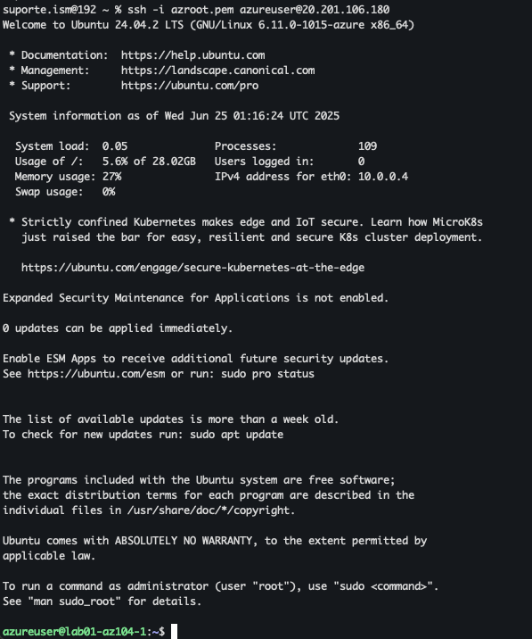

# Desafio: Gerenciando Máquinas Virtuais no Azure

Este desafio faz parte da formação **AZ-104: Azure Administrator Associate** na plataforma DIO. O objetivo é praticar a criação, gerenciamento e operação de máquinas virtuais no Azure, utilizando tanto o **Portal Azure** quanto a **Azure CLI**.

---

## Objetivo

Criar e gerenciar máquinas virtuais Linux no Azure, explorando operações essenciais como:

- Implantação de VMs
- Início e parada da VM
- Acesso remoto via SSH
- Gerenciamento de disco (desanexar)
- Verificação de status e conectividade

---

## Etapas Realizadas

### 1. Implantação de Máquinas Virtuais (Portal)

- Criadas duas VMs com imagem **Ubuntu**
- Tamanho: `Standard_B1s`
- Local: `Brazil South`
- Grupo de recursos: `rg-az104gmva`


**Visualização no portal VMs iniciadas:**


---

### 2. Anexando Disco da Máquina

- Simulação de manutenção via **Portal Azure**
- Anexado manualmente o disco de dados
- Reflete uma tarefa típica de suporte ou ajuste de armazenamento



---

### 3. Desanexando Disco da Máquina

- Simulação de manutenção via **Portal Azure**
- Desanexado manualmente o disco de dados
- Reflete uma tarefa típica de suporte ou ajuste de armazenamento



---

### 4. Gerenciamento com Azure CLI

Comandos executados via terminal para controle direto das VMs.


```bash
# Login no Azure
az login
```


```
# (Opcional) Definir assinatura
az account set --subscription "Nome da assinatura"
```


```
# Listar todas as VMs com status
az vm list -d -o table
```


```
# Parar uma VM
az vm stop \
  --name lab01-az104-1 \
  --resource-group rg-az104gmva
```





```
# Iniciar uma VM
az vm start \
  --name lab01-az104-1 \
  --resource-group rg-az104gmva
```





```
# Reiniciar uma VM
az vm restart \
  --name lab01-az104-2 \
  --resource-group rg-az104gmva
```
```
# Obter status detalhado da VM
az vm get-instance-view \
  --name lab01-az104-1 \
  --resource-group rg-az104gmva \
  --output table
```
```
# Abrir porta (ex: SSH)
az vm open-port \
  --name lab01-az104-1 \
  --resource-group rg-az104gmva \
  --port 22
```


**Acessando via SSH**



```
# Desanexar disco de dados
az vm disk detach \
  --name datadisk01 \
  --vm-name lab01-az104-1 \
  --resource-group rg-az104gmva
```

## Estrutura da Pasta

```
desafios/
└── gerenciando-vms/
    ├── images/
    │   ├── acessossh.png
    │   ├── adddisk.png
    │   ├── azaccount.png
    │   ├── azimp01.png
    │   ├── azimp02.png
    │   ├── azimp03.png
    │   ├── azimp04.png
    │   ├── azlistvm.png
    │   ├── azlogin.png
    │   ├── aznrgrule.png
    │   ├── azstartvm.png
    │   ├── azstopvm.png
    │   ├── azure-vms-criadas-portal.png
    │   ├── detachdisk.png
    │   ├── startvmportal.png
    │   └── stopvmportal.png
    └── README.md
```

## Referências

- [Início Rápido: Criar uma máquina virtual do Linux no portal do Azure](https://learn.microsoft.com/pt-br/azure/virtual-machines/linux/quick-create-portal?tabs=ubuntu)
- [Tutorial Oficial - CLI: Gerenciar VMs no Azure](https://learn.microsoft.com/pt-br/azure/virtual-machines/windows/tutorial-manage-vm)
- [Documentação Oficial do Azure CLI](https://learn.microsoft.com/pt-br/cli/azure/)