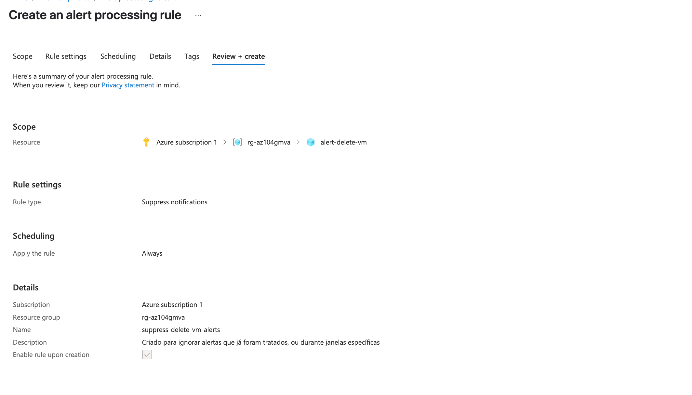

# Desafio: Monitoramento de Máquinas Virtuais no Azure (Em andamento)

## Objetivo

Este repositório foi criado como parte do desafio prático da formação AZ-104 na DIO, com foco em configuração e gerenciamento de monitoramento no Azure. O projeto demonstra como aplicar conceitos de observabilidade em máquinas virtuais para detectar eventos críticos como a exclusão de uma VM.

## Aprendizados e Habilidades Desenvolvidas

- Configuração de alertas no Azure Monitor
- Uso de Log Analytics e consultas com KQL
- Criação de Action Groups para envio de e-mails
- Implantação de regras de processamento
- Documentação técnica com GitHub e Markdown

## Cenário do Laboratório

**Desenho do cenário a ser criado.**


- Grupo de Recursos: `rg-az104gmva`
- Recursos monitorados: 
  - Máquina virtual `lab01-az104-1`
  - Máquina virtual `lab01-az104-2`
- Evento monitorado: Exclusão de qualquer uma das VMs
- Ação: Envio de alerta por e-mail via Action Group
- Consulta: Log query para rastrear atividade de deleção das VMs

## Etapas do Projeto

### Task 1 – Criar as VMs `lab01-az104-1` e `lab01-az104-2`
Provisionamento das máquinas virtuais no Azure, com monitoramento habilitado para ambas.


**Observações sobre compatibilidade**

As VMs utilizadas neste laboratório estavam baseadas na imagem `Ubuntu 24.04 LTS`, que atualmente **não é compatível com o Dependency Agent** necessário para mapas de dependência (VM Insights completo). Por isso, a solução de monitoramento foi adaptada para utilizar apenas o **Azure Monitor Agent (AMA)** com um Data Collection Rule (DCR).

Essa abordagem permite:

- Coleta de métricas básicas (CPU, memória, disco)
- Envio de logs ao Log Analytics Workspace
- Criação de alertas com base em métricas via Azure Monitor


### Task 2 – Criar alerta para deleção das VMs
Configuração de um alerta baseado no Azure Activity Log para capturar eventos de exclusão das VMs.


**Observação sobre Severidade do Alerta:** Este alerta foi configurado com base no Azure Activity Log, utilizando o sinal Delete Virtual Machine (Virtual Machines).

Neste tipo de alerta:
A severidade (severity) não pode ser definida manualmente como em alertas baseados em métricas.
O nível de severidade é atribuído automaticamente pelo Azure, conforme a classificação do evento.
É possível utilizar o filtro Event Level durante a configuração para limitar o escopo a eventos críticos, erros ou informativos.
Embora não seja possível personalizar a severidade neste cenário, a exclusão de uma máquina virtual representa um evento crítico e deve ser monitorada com alta prioridade, especialmente em ambientes de produção ou testes sensíveis.


Foi configurado um alerta no Azure Monitor baseado no Activity Log para detectar eventos do tipo Delete Virtual Machine. A regra foi associada ao grupo de recursos rg-az104gmva e foi parametrizada para:
- Sinal monitorado: Delete Virtual Machine (Virtual Machines)
- Período de avaliação (chart period): últimas 6 horas
- Escopo: Máquinas virtuais lab01-az104-1 e lab01-az104-2
- Condição: Qualquer evento de exclusão iniciado por qualquer usuário ou serviço
- Ação: Enviar e-mail através do Action Group configurado (detalhado na Task 3)

O alerta será disparado automaticamente ao detectar exclusões dentro do intervalo definido, permitindo rápida resposta administrativa.

### Task 3 – Criar Action Group
Criação de um grupo de ação que envia notificação por e-mail sempre que o alerta for disparado.

Nesta etapa, criamos um Action Group no Azure para envio de alertas por e-mail. O grupo foi nomeado **InfraCloudBR-ADMS** com o nome de exibição **icbr-adms**, e está configurado para enviar notificações para infracloudbr@gmail.com sempre que o alerta for disparado.


**Criando o Grupo de ações**


Foi criado um Action Group no Azure Monitor para envio de alertas por e-mail em caso de exclusão de máquinas virtuais no grupo de recursos rg-az104gmva.

Configurações do Action Group:
- Nome do Action Group: InfraCloudBR-ADMS
- Recurso associado: Grupo de recursos rg-az104gmva
- Tipo de ação configurada: Notificação por e-mail
- Destinatário: infracloudbr@gmail.com

Esse Action Group foi vinculado à regra de alerta criada na Task 2, garantindo que qualquer tentativa de exclusão de VM seja rapidamente sinalizada à equipe responsável.

### Task 4 – Disparar o alerta
Simulação da exclusão de uma das VMs para validar o alerta e o acionamento do Action Group.


Nesta etapa, foi realizada a exclusão da máquina virtual lab01-az104-2 no Azure, com o objetivo de simular um evento de exclusão que ativa a regra de alerta configurada na Task 2. A exclusão gerou um registro no Azure Activity Log, que por sua vez acionou a alerta de exclusão de VM e disparou o Action Group configurado na Task 3, enviando um e-mail de notificação para o endereço definido.

### Task 5 – Adicionar regra de processamento
Aplicação de regras para controlar notificações ou ignorar alertas repetidos.




Foi configurada uma regra de processamento de alertas (Alert Processing Rule) com o objetivo de suprimir notificações de alertas repetidos, evitando alertas redundantes para eventos que já foram tratados. A regra suppress-delete-vm-alerts está associada ao recurso alert-delete-vm no grupo de recursos rg-az104gmva, e está programada para ser aplicada sempre que o alerta for disparado. Com isso, garantimos um controle mais eficiente sobre a geração e o envio de notificações, reduzindo ruídos e aumentando a assertividade do monitoramento.

### Task 6 – Consultar logs com KQL
Uso do Log Analytics para visualizar eventos no Azure Activity Log com consultas KQL.

- Exemplo de consulta KQL para identificar deleção de VMs:

```kql
AzureActivity
| where OperationNameValue == "Microsoft.Compute/virtualMachines/delete"
| sort by TimeGenerated desc 
```


```kql
Heartbeat
| where Computer == "lab01-az104-2"
| sort by TimeGenerated desc
```


Como o recurso AzureActivity não retornou dados (possivelmente por ausência de configuração ou log não enviado ao workspace), validamos a exclusão da VM lab01-az104-2 com base nos dados do Log Analytics, especificamente na ausência de novos registros da tabela Heartbeat, sendo o último batimento detectado em 28/06/2025 às 21:54 UTC. Isso evidencia que a máquina foi excluída com sucesso, mesmo sem log de atividade disponível.

**Configurando o Diagnostic Setting da Subscrição**

Como garantir que o AzureActivity funcione para futuras ações:
1. Vá para: Azure Portal → Pesquisa → "Activity log"
Selecione sua Subscription → clique em “Export to Log Analytics” (ou "Diagnostic settings").

2. Crie uma nova configuração de diagnóstico para a Subscription:

Nome: diag-subscription-logs
Marque:
AuditLogs
Administrative
Security
(ou AllLogs)

Selecione:

Send to Log Analytics workspace → escolha seu lab01-monitor

3. Salve. A partir daqui, tudo que você criar, apagar, alterar na subscrição será enviado pro Log Analytics.


## Dicas e Notas

- Documentação oficial:  
  https://learn.microsoft.com/pt-br/azure/azure-monitor/vm/vminsights-overview
  https://learn.microsoft.com/pt-br/training/modules/configure-monitoring-virtual-machines/

