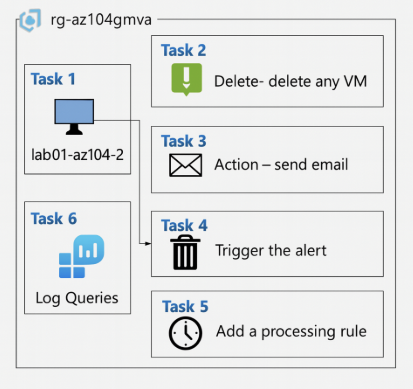

# Desafio: Monitoramento de Máquinas Virtuais no Azure (Em andamento)

## Objetivo

Este repositório foi criado como parte do desafio prático da formação AZ-104 na DIO, com foco em configuração e gerenciamento de monitoramento no Azure. O projeto demonstra como aplicar conceitos de observabilidade em máquinas virtuais para detectar eventos críticos como a exclusão de uma VM.

## Aprendizados e Habilidades Desenvolvidas

- Configuração de alertas no Azure Monitor
- Uso de Log Analytics e consultas com KQL
- Criação de Action Groups para envio de e-mails
- Implantação de regras de processamento
- Documentação técnica com GitHub e Markdown

## Cenário do Laboratório

**Desenho do cenário a ser criado.**



- Grupo de Recursos: `rg-az104gmva`
- Recursos monitorados: 
  - Máquina virtual `lab01-az104-1`
  - Máquina virtual `lab01-az104-2`
- Evento monitorado: Exclusão de qualquer uma das VMs
- Ação: Envio de alerta por e-mail via Action Group
- Consulta: Log query para rastrear atividade de deleção das VMs

## Etapas do Projeto

### Task 1 – Criar as VMs `lab01-az104-1` e `lab01-az104-2`
Provisionamento das máquinas virtuais no Azure, com monitoramento habilitado para ambas.


## Observações sobre compatibilidade

As VMs utilizadas neste laboratório estavam baseadas na imagem `Ubuntu 24.04 LTS`, que atualmente **não é compatível com o Dependency Agent** necessário para mapas de dependência (VM Insights completo). Por isso, a solução de monitoramento foi adaptada para utilizar apenas o **Azure Monitor Agent (AMA)** com um Data Collection Rule (DCR).

Essa abordagem permite:

- Coleta de métricas básicas (CPU, memória, disco)
- Envio de logs ao Log Analytics Workspace
- Criação de alertas com base em métricas via Azure Monitor


### Task 2 – Criar alerta para deleção das VMs
Configuração de um alerta baseado no Azure Activity Log para capturar eventos de exclusão das VMs.

### Task 3 – Criar Action Group
Criação de um grupo de ação que envia notificação por e-mail sempre que o alerta for disparado.

### Task 4 – Disparar o alerta
Simulação da exclusão de uma das VMs para validar o alerta e o acionamento do Action Group.

### Task 5 – Adicionar regra de processamento
Aplicação de regras para controlar notificações ou ignorar alertas repetidos.

### Task 6 – Consultar logs com KQL
Uso do Log Analytics para visualizar eventos no Azure Activity Log com consultas KQL.

## Captura de Tela do Fluxo

Imagem disponível na pasta `/images`:
- `fluxo-monitoramento.png`

## Dicas e Notas

- Documentação oficial:  
  https://learn.microsoft.com/pt-br/azure/azure-monitor/vm/vminsights-overview
  https://learn.microsoft.com/pt-br/training/modules/configure-monitoring-virtual-machines/

- Exemplo de consulta KQL para identificar deleção de VMs:

```kql
AzureActivity
| where OperationNameValue == "Microsoft.Compute/virtualMachines/delete"
| sort by TimeGenerated desc
